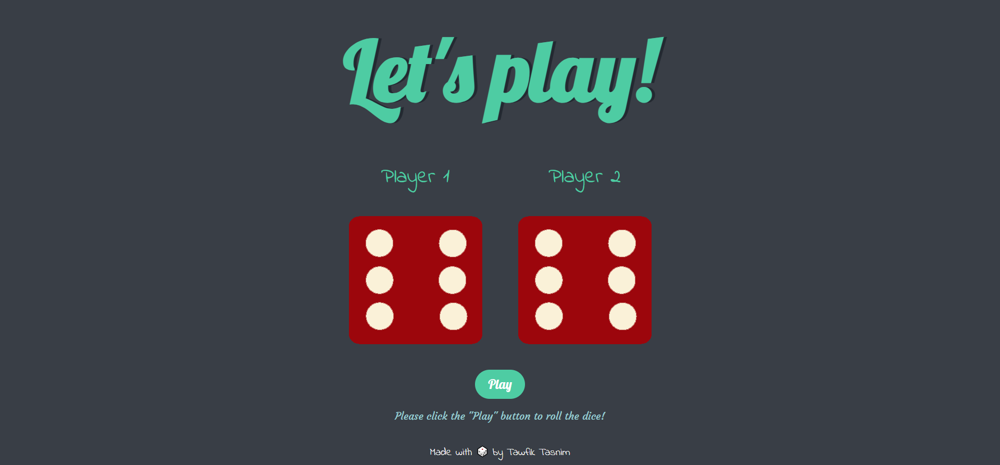

# Dice Play

The Dice Play is a web-based game developed using HTML, CSS, and JavaScript that brings the excitement of rolling dice to the screen. It is a simple and interactive game where two virtual players compete against each other to see who can roll the highest points. In the game, a user click a play button to initiate a round. Two dice are rolled for each virtual player, generating random numbers. The points of the players are then compared, and the player with the higher points wins the round.

## Features

This website includes the following features:

* **Play Button:** The game interface includes a "Play" button that allows players to start a new round. By clicking this button, the dice will be rolled, and the scores or points will be calculated.
* **Random Dice Roll:** The game generates random numbers for each player's dice roll, simulating the unpredictability of physical dice.
* **Round-based Gameplay:** The game is played in rounds, allowing players to compete against each other multiple times.
* **Interactive Interface:** The game features an intuitive and user-friendly interface that makes it easy for players to initiate rounds and view their scores or points.

## Technologies Used

This website is built using the following technologies:

* **HTML:** It is used to structure the game's interface, define elements, and create the layout of the game.
* **CSS:** It is employed to apply styles, colors, and visual effects to the game's interface, making it visually appealing and user-friendly.
* **JavaScript:** It is used to implement the game logic, handle user interactions, and provide dynamic functionality such as rolling the dice, calculating scores, and updating the game state in real-time.

These technologies were chosen for their widespread use, compatibility with web browsers, and their ability to create interactive and visually appealing web pages.

## 🛠 Installation and Setup Instructions

1. git clone https://github.com/tawfik575/dice-play.git
2. cd dice-play
3. start index.html

## Contributing

Contributions to Dice Play are welcome! If you find a bug or have an idea for an improvement, please submit an issue or create a pull request. Make sure to follow the existing code style and provide detailed information about your changes.

## License

This project is licensed under the MIT License. Feel free to use, modify, and distribute the code as per the terms of the license.

## Contact

If you have any questions, suggestions, or feedback about the project, feel free to contact me at `tawfikbsmrstucse@gmail.com`.